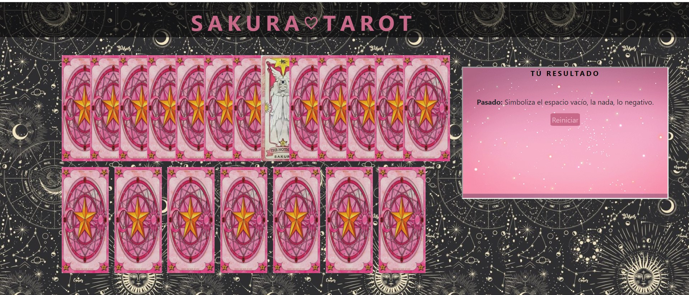

<h1>Sakura Tarot</h1>

<h2>Introducción</h2>

El siguiente proyecto ha sido desarrollado por los alumnos de Factoría F5, doña Celia Cueria Barcia y don Jordy Iglesias Differding, cuyo objetivo era la elaboración de un mini-juego en el qué a través de una baraja de cartas el usuario fuera capaz de conocer e interpretar su pasado, su presente y su futuro. Esté proyecto ha sido propuesto por el personal docente de la referida escuela, don Diego Córdoba Jofre y don Amr Hafny, con la colaboración cercana de la responsable de promoción doña Ana Álvarez.

<h2>Tecnologías</h2>
<ul>
    <li>HTML</li>
    <li>CSS</li>
    <li>JavaScript</li>
    <li>React js</li>
</ul>

<h2>Herramientas</h2>
<ul>
    <li>Visual Studio Code</li>
    <li>Jira</li>
    <li>Figma</li>
    <li>GitHub</li>
</ul>

<h2>Requisitos</h2>
 <ul> 
     <li>Ver todas las cartas boca abajo</li>
     <li>Elegir 3 cartas</li>
     <li>Ver el significado de las 3 cartas</li>
    
</ul>

